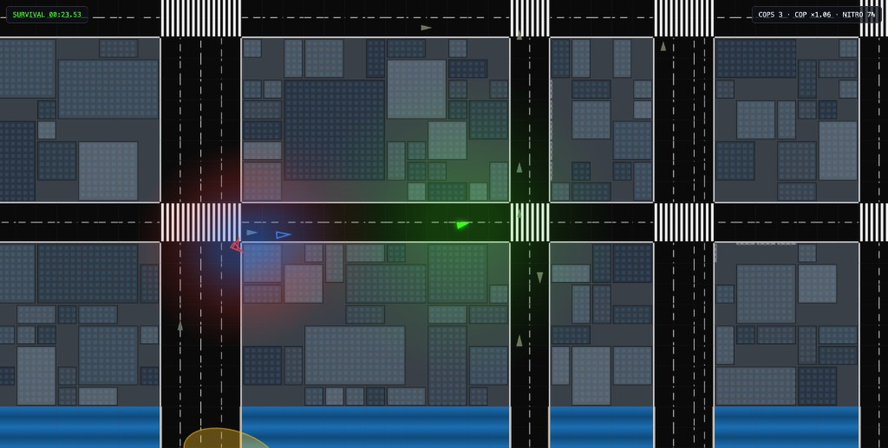
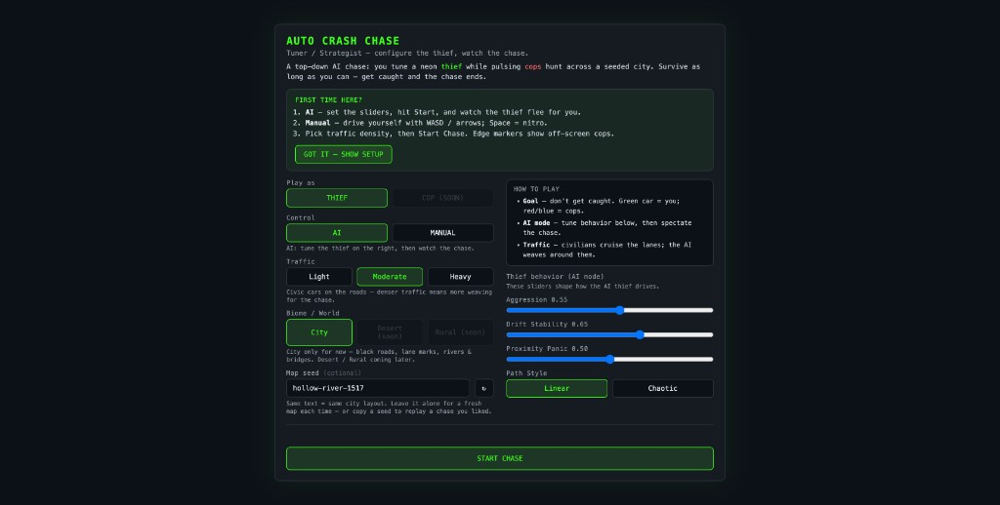
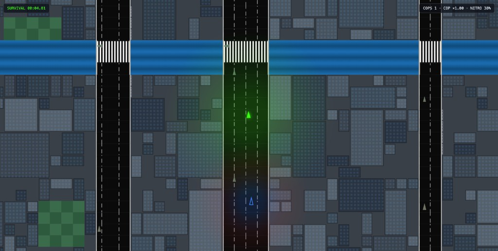
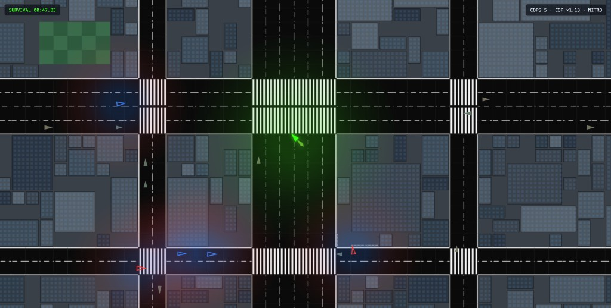
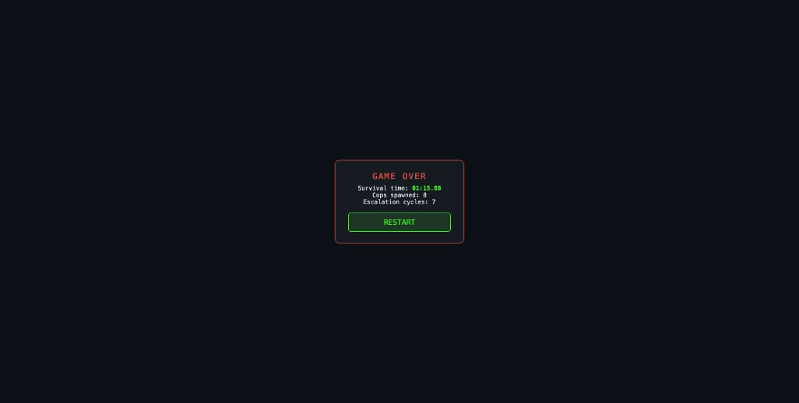

# Auto Crash Chase

A 100% client-side top-down chase game. You play as the neon **thief** — either tune an AI getaway driver or grab the wheel yourself — while pulsing **cops** hunt you through a seeded city full of civic traffic.

Survive as long as you can. Get caught, and the chase ends.

<p align="center">
  
</p>

## Screenshots

| Setup | Chase |
| ----- | ----- |
|  |  |
|  |  |

## What you do

1. **Configure the match** — Thief mode, AI or Manual control, traffic density, map seed.
2. **AI mode** — dial Aggression / Drift Stability / Proximity Panic / Path Style, then watch the thief flee.
3. **Manual mode** — drive with **WASD** or **arrow keys**; hold **Space** for nitro.
4. **Survive** — weave through lane-following traffic, dodge the pack, use edge markers to spot off-screen cops.
5. **Game over** — see survival time, cops spawned, and escalation cycles; restart for a fresh seed.

Cop mode is marked *coming soon* on the setup screen.

## Features

- **AI or Manual thief** — strategist sliders, or keyboard drive + nitro
- **Escalating cop pack** — spawn cadence, radio last-known contact, Lead / Flank / Ambush roles
- **Civic traffic** — two-way lane rules (H: left/west · right/east; V: up/north · down/south); junction turns; follow/brake so civics don’t pile into each other
- **Seeded infinite city** — chunked world, arterials, bridges, zebra crossings; random seed each visit (same text → same layout)
- **Traffic difficulty** — Light / Moderate / Heavy instead of building density
- **Road spills** — periodic traction drops on asphalt
- **Off-screen cop markers** — pulsing edge dots when pursuers are outside the camera
- **Fully offline** — no backend; runs as a static Vite site

> **WebLLM note:** Natural-language “describe driving style” → slider config is implemented (`@mlc-ai/web-llm` in a Web Worker) but the prompt UI is temporarily hidden. Manual sliders still tune AI behavior.

## Run locally

```bash
npm install
npm run dev
```

Open the URL Vite prints (usually `http://localhost:5173`).

```bash
npm run build    # production build → dist/
npm run preview  # serve the production build
```

## Controls

| Input | Action |
| ----- | ------ |
| **W / ↑** | Accelerate |
| **A / ←** · **D / →** | Turn |
| **S / ↓** | Brake |
| **Space** | Nitro (short boost, then refill) |

Setup overlay also covers traffic level, biome (City live; Desert / Rural soon), optional map seed + reroll, and AI behavior sliders.

## Stack

| Layer | Tech |
| ----- | ---- |
| Language / bundler | TypeScript + Vite |
| Render | HTML5 Canvas 2D (camera follows the thief) |
| Physics | Matter.js (cars only; buildings are grid-collided) |
| AI | Craig Reynolds steering + A\* pathfinding |
| World | Chunked infinite map (`ChunkWorld` + biomes) |
| LLM (optional) | `@mlc-ai/web-llm` / WebGPU worker |
| RNG | String-seeded PRNG for replayable layouts |

## Project layout

```
src/
  core/          Game loop, camera, RNG, types
  entities/      Car, Thief, Cop, TrafficCar
  ai/            Steering, CopManager, CopRadio, TrafficManager
  map/           Chunks, biomes, A*, spills, traffic lanes
  physics/       Matter.js world helpers
  ui/            Setup, HUD, game-over, off-screen markers
  llm/           WebLLM client + worker
  config/        Tunables (speeds, traffic presets, colors)
references/      Blueprint, architecture, world notes, screenshots
```

## Documentation

| Doc | Purpose |
| --- | ------- |
| [`references/BLUEPRINT.MD`](references/BLUEPRINT.MD) | Authoritative system design / expectations |
| [`references/ARCHITECTURE.md`](references/ARCHITECTURE.md) | Module map, match data flow, cop radio |
| [`references/WORLD.md`](references/WORLD.md) | Biomes, roads, chunk rules |
| [`AGENTS.md`](AGENTS.md) | Agent conventions, decisions, changelog |

## License

See [`LICENSE`](LICENSE).
